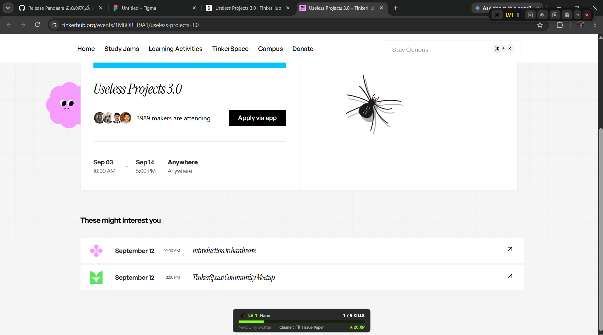
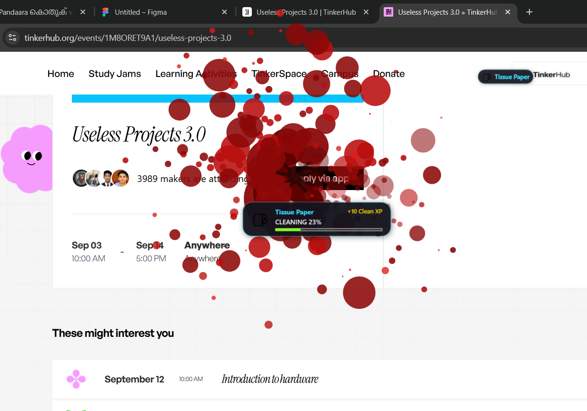
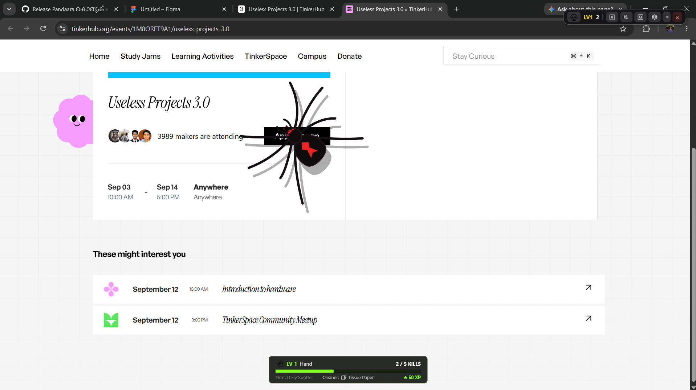
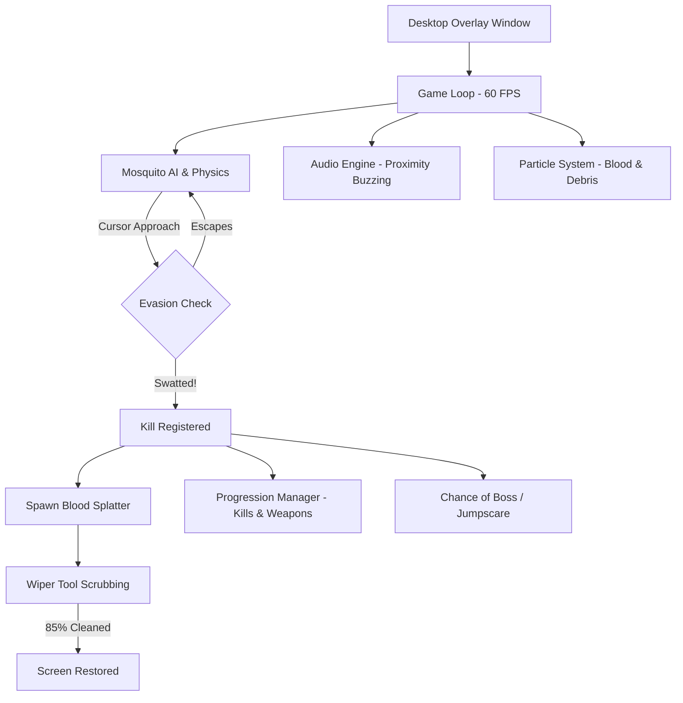

# Pandaara കൊതുക് 🎯

> The ultimate useless desktop menace — a hyper-realistic, annoying digital mosquito that buzzes over your windows, splatters blood on your screen when swatted, and forces you to scrub your monitor clean!

🌐 **Live Website:** [https://aravinnndddd.github.io/Pandaara-kodhuk/PK-Web/](https://aravinnndddd.github.io/Pandaara-kodhuk/PK-Web/)  
📖 **Read the Origin Story:** [The Story Behind Pandara Kothuk 🦟 (Storytelling.md)](Storytelling.md)

---

## Basic Details

### Team Name: Aravind P 

### Team Members
- **Team Lead:** Aravind P - College of Engineering Perumon

---

### Project Description
**Pandaara കൊതുക്** (The Annoying Desktop Mosquito) is a transparent Windows desktop companion game designed to ruin your productivity in the best way possible. An erratic digital mosquito flies around, lands on your code or browser tabs, and buzzes directly into your ears. Swatting it splatters realistic blood all over your screen that you have to physically wipe off with squeegees, all while unlocking bigger weapons, surviving random jumpscares, and battling occasional nightmare boss creatures.

---

### The Problem (that doesn't exist)
Modern operating systems are far too peaceful and productive. Programmers and students sit in air-conditioned rooms staring quietly at monitors, completely deprived of the ancient human instinct to violently smack things out of sheer annoyance. There was no way to experience the pure rage of a mosquito buzzing near your ear at 3 AM while sitting at your PC.

---

### The Solution (that nobody asked for)
We built a transparent, topmost desktop overlay that introduces realistic mosquito harassment straight into Windows:
- **Erratic flight physics & evasion**: It dodges when your cursor gets close.
- **3D dynamic buzzing audio**: Loops relentlessly and changes intensity based on flight state.
- **Screen-staining blood splatters**: Hitting it splatters messy blood droplets across your monitor that persist over all your windows.
- **Cleaner & wiper progression**: You can't see your work until you drag unlockable wipers and sponges across the screen to clean the mess.
- **Weapon arsenal**: Level up with every kill from bare hands to newspaper, chappal (slipper), hammer, vacuum, and electric bat.
- **Jumpscares & Boss Fights**: Beware of screen-cracking monster jumpscares and giant desktop spider bosses!

---

## Technical Details

### Technologies/Components Used

#### For Software:
- **Languages used:** C# (.NET 8.0)
- **Frameworks used:** WPF (Windows Presentation Foundation)
- **APIs & Libraries:**
  - `User32.dll` (Win32 Interop for transparent, click-through overlay management)
  - `System.Windows.Media` & `MediaPlayer` (Low-latency audio playback)
  - `System.Windows.Threading` (60 FPS game loop and particle simulation)
  - `System.Text.Json` (Persistent save game and kill progression system)
- **Tools used:** Visual Studio, Visual Studio Code, .NET CLI, Git, PowerShell

### 📁 Modular Architecture
```text
Pandaara-kodhuk/
├── Creatures/           # Entity models (Mosquito, Spider, GiantSpider, BossCreatures)
├── Rendering/           # Procedural vector renderers (Mosquito, Spiders, Monsters, Glass Cracks)
├── Systems/             # Core game systems (Progression, Cleaners, Jumpscares, Audio, Weapons, Save)
├── Config/              # Game balance, blood settings, and state configs
├── Sounds/              # Audio clips and sound effects
├── .github/workflows/   # GitHub Actions automated release pipeline
├── MainWindow.xaml/.cs  # Transparent desktop overlay HUD & game canvas
├── publish.ps1          # 1-click zero-dependency release builder
├── Storytelling.md      # The origin story of the project
├── README.md            # Project documentation
└── index.html           # TinkerHub project journal
```

#### For Hardware:
- *N/A (Pure software madness — no real mosquitoes were harmed, though monitor longevity may vary)*

---

## Implementation

### For Software:

#### Prerequisites
- Windows 10 or Windows 11 (64-bit)
- [.NET 8.0 Desktop Runtime or SDK](https://dotnet.microsoft.com/download/dotnet/8.0)

#### Installation & Build
```powershell
# Clone repository
git clone https://github.com/aravinnndddd/Pandaara-kodhuk.git

# Navigate into project directory
cd Pandaara-kodhuk

# Restore dependencies and build
dotnet build
```

#### Run
```powershell
# Run directly via .NET CLI
dotnet run

# Or launch compiled binary
.\bin\Debug\net8.0-windows\PandaaraKodhuk.exe
```

---

## Key Game Mechanics

### ⚔️ Weapon Progression (Kill-Based)
| Level | Kills Required | Weapon | Description |
|:---:|:---:|:---|:---|
| **1** | 0 | 👋 Bare Hand | Basic smack, small hitbox |
| **2** | 5 | 🪰 Fly Swatter | Faster swing speed |
| **3** | 10 | 📰 Rolled Newspaper | Wider reach |
| **4** | 15 | 🩴 Slipper (Chappal) | Classic weapon of destruction |
| **5** | 25 | 🏏 Bat | Heavy impact |
| **6** | 40 | 🔨 Hammer | Cracks screen glass |
| **7** | 60 | 🌀 Vacuum | Sucks pests from distance |
| **8** | 100 | ⚡ Electric Swatter | Zaps pests with sparks |
| **9** | 150 | 🩴 Giant Slipper | Screen-clearing boss weapon |
| **10** | 250 | 💥 Ultimate Swatter | Absolute mosquito extinction |

### 🧽 Cleaner / Wiper Progression (Cleans Splattered Blood)
| Level | Wipe Radius | Tool |
|:---:|:---:|:---|
| **1** | 40px | 🖐️ Hand Wipe |
| **2** | 65px | 🧼 Microfiber Cloth |
| **3** | 95px | 🧽 Sponge |
| **4** | 135px | 🪟 Rubber Squeegee |
| **5** | 180px | 🚿 High-Pressure Wiper |

---

## Project Documentation

### Screenshots


*Desktop overlay with mosquito wandering and HUD active*


*Blood splatters on screen with cleaning squeegee wiping the display*


*Progression bar, level unlocks, and settings drawer*

---

### Architecture / Workflow



---

## Project Demo

### Live Website
🌐 **[https://aravinnndddd.github.io/Pandaara-kodhuk/PK-Web/](https://aravinnndddd.github.io/Pandaara-kodhuk/PK-Web/)**

### Video
[Add your demo video link here]
*Demonstration of mosquito flight, swatting action, blood splatter mechanics, weapon unlocks, and wiper tool.*

---

## Team Contributions
- **Aravind P**: Concept design, C# WPF architecture, overlay rendering, game physics, audio integration, progression system, weapon & cleaner mechanics, and chaotic bug testing.

---

Made with ❤️ at TinkerHub Useless Projects 


